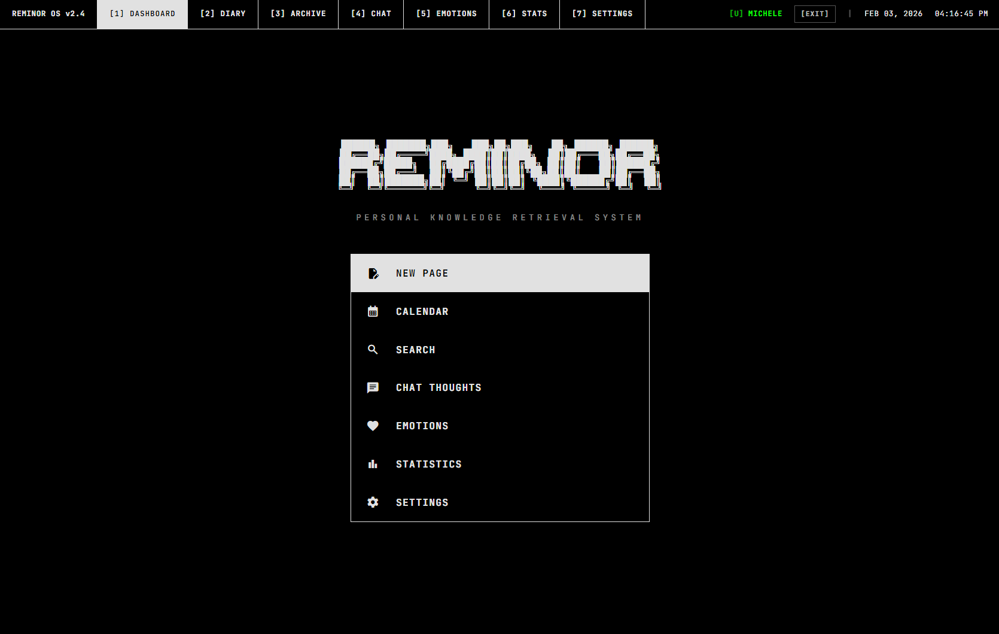
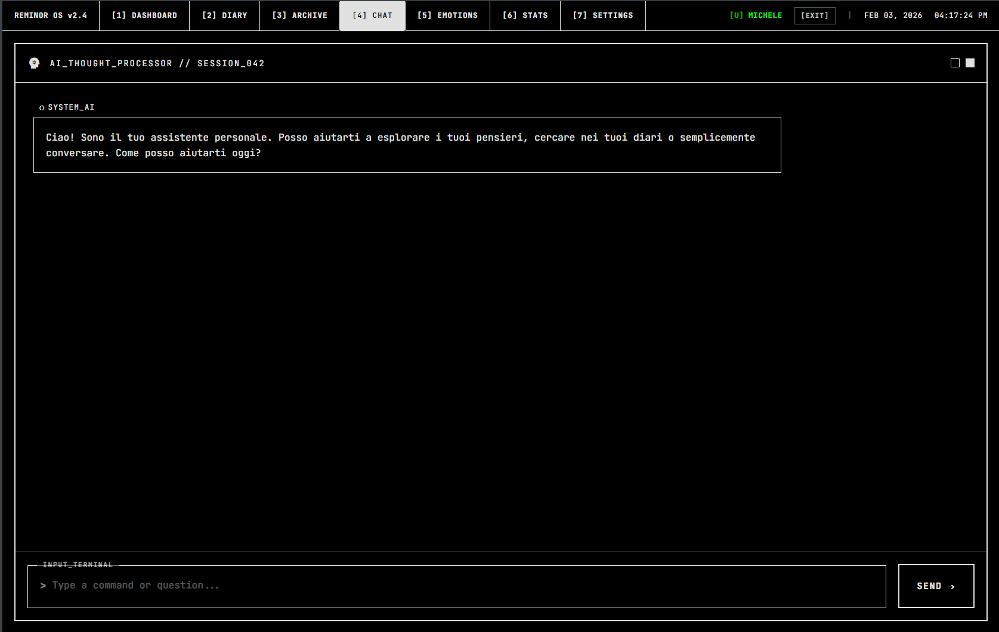
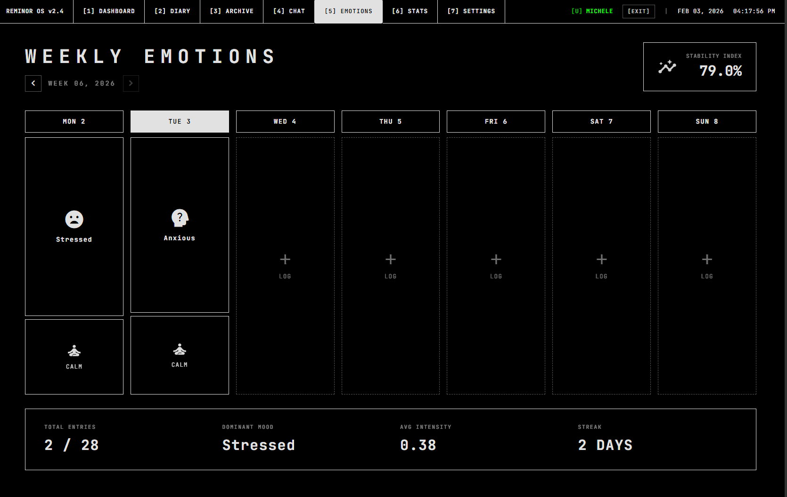
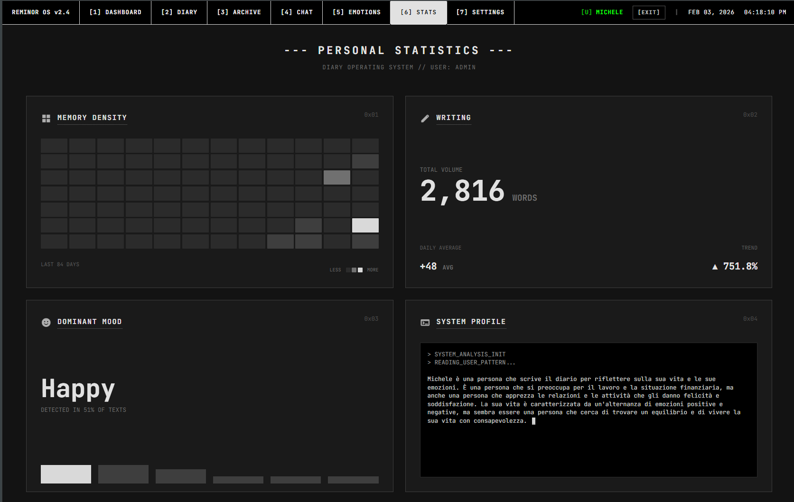

# Reminor

An AI-powered personal diary. Write your thoughts, and Reminor analyzes them, remembers them, and chats with you about them.

**[Try the live demo](https://app.reminor.it)** | **[Privacy Policy](PRIVACY_POLICY_EN.md)**

## What it does

Reminor is not just a simple diary. Every time you write, the system:

- **Analyzes your emotions** - 8 emotional dimensions tracked over time
- **Builds semantic memory** - search by meaning, not just keywords
- **Talks with you** - an AI chat that knows your diary and your context
- **Shows your trends** - statistics, writing streaks, emotional evolution

Supports Italian and English.

## Screenshots

| Dashboard | Calendar |
|:-:|:-:|
|  |  |

| AI Chat | Weekly Emotions |
|:-:|:-:|
|  |  |

| Statistics |
|:-:|
|  |

## How to try it

1. Go to **[app.reminor.it](https://app.reminor.it)** and create an account
2. Go to **Settings** > **Configure LLM** and enter an API key (see [supported providers](#supported-providers))
3. Write your first diary page and click **Analyze emotions**

Without an API key you can write and browse the diary, but the AI chat and emotion analysis won't work.

## Supported Providers

AI is not included: bring your own API key. These are the supported providers:

| Provider | Recommended Models | Where to get the key |
|----------|-------------------|----------------------|
| Groq | llama-3.3-70b-versatile | [console.groq.com](https://console.groq.com) |
| Google | gemini-2.0-flash | [aistudio.google.com](https://aistudio.google.com) |
| OpenAI | gpt-4o-mini | [platform.openai.com](https://platform.openai.com) |
| Anthropic | claude-3-5-sonnet | [console.anthropic.com](https://console.anthropic.com) |
| Mistral | mistral-large-latest | [console.mistral.ai](https://console.mistral.ai) |
| DeepSeek | deepseek-chat | [platform.deepseek.com](https://platform.deepseek.com) |

**Groq** and **Google** offer free plans sufficient for personal use.

The key is encrypted server-side (Fernet encryption) and associated with your account.

## Self-hosting

Want to install it on your server? You only need Docker.

### Quick deploy (production)

```bash
git clone https://github.com/cristal-orion/Reminor.git
cd Reminor

# Configure
cp .env.production.template .env.production
# Edit .env.production: set JWT_SECRET_KEY, HF_TOKEN, and DOMAIN

# Start
docker compose -f docker-compose.prod.yml up --build -d
```

By default `DOMAIN=:80` serves over plain HTTP on all interfaces — access via `http://<your-ip>`.
Set `DOMAIN=yourdomain.com` in `.env.production` for automatic SSL via Let's Encrypt.

### Environment Variables

```env
# Required
JWT_SECRET_KEY=...   # python -c "import secrets; print(secrets.token_hex(32))"

# For the embeddings model (semantic search)
HF_TOKEN=...         # Token from huggingface.co/settings/tokens
                     # Requires access to google/embeddinggemma-300m

# Domain (optional, defaults to :80 for local/IP access)
DOMAIN=:80           # or yourdomain.com for automatic SSL
```

### Development deploy (local)

```bash
# Backend
python -m venv venv && source venv/bin/activate
pip install -r requirements.txt
cd backend && uvicorn api.main:app --reload --port 8000

# Frontend (another terminal)
cd reminor-frontend && npm install && npm run dev
```

Open http://localhost:5173

---

## Architecture

```
Browser (Svelte 5)
    |
    v
  Caddy (SSL + reverse proxy)
    |
    v
  FastAPI (backend)
    |
    +-- LiteLLM (chat, emotion analysis)
    +-- Sentence-Transformers (local embeddings)
    +-- Memvid (semantic memory)
```

### Tech Stack

| Layer | Technology |
|-------|-----------|
| Frontend | Svelte 5, Vite |
| Backend | FastAPI, Uvicorn, Python 3.11 |
| AI | LiteLLM (multi-provider), Sentence-Transformers, Memvid |
| Auth | JWT + bcrypt + Fernet (API keys encryption) |
| Deploy | Docker, Caddy (automatic SSL) |

### Data Structure

```
data/
+-- users.json                    # Users database (bcrypt passwords, encrypted LLM config)
+-- {user_id}/
    +-- journal/
    |   +-- YYYY-MM-DD.txt        # Diary pages (plain text)
    +-- emotions.json             # Analyzed emotions
    +-- memory.mv2                # Semantic memory (memvid)
    +-- memory.npz                # Embeddings (sentence-transformers)
```

### API

<details>
<summary>Main Endpoints</summary>

**Authentication**
| Endpoint | Method | Description |
|----------|--------|-------------|
| `/auth/register` | POST | Registration |
| `/auth/login` | POST | Login (returns JWT) |
| `/auth/me` | GET | User info |
| `/auth/settings/llm` | PUT | Save LLM configuration |
| `/auth/settings/language` | PUT | Change language (it/en) |

**Diary**
| Endpoint | Method | Description |
|----------|--------|-------------|
| `/journal/entries` | GET | Pages list |
| `/journal/entries` | POST | Save page |
| `/journal/entries/{date}` | GET | Read page |
| `/journal/entries/{date}/analyze` | POST | Analyze emotions |
| `/journal/entries/{date}/emotions` | GET | Saved emotions |
| `/journal/search` | POST | Semantic search |
| `/journal/stats` | GET | Statistics |
| `/journal/backup/zip` | GET | Download backup |
| `/journal/rebuild-vectors` | POST | Rebuild semantic index |

**Chat**
| Endpoint | Method | Description |
|----------|--------|-------------|
| `/chat` | POST | AI chat message |
| `/health` | GET | Health check |

</details>

## License

MIT
